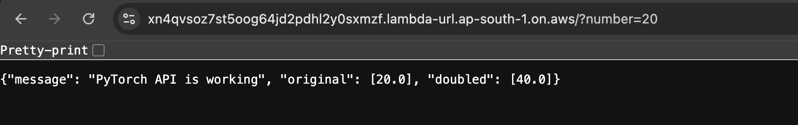
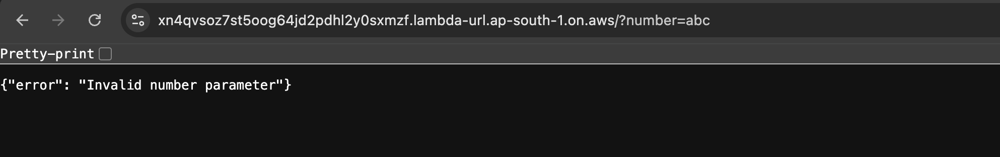

# AWS Lambda + PyTorch (Container Image Method) + Parameterized API

Live Demo URL - https://xn4qvsoz7st5oog64jd2pdhl2y0sxmzf.lambda-url.ap-south-1.on.aws/

## What We Are Building

We are running PyTorch inside AWS Lambda. Usually, this is tricky because PyTorch is a massive library (over 700MB) and Lambda has strict size limits.

To get around this, we are using Docker to package our code into a "container image." This lets us bypass those size limits and run heavy AI workloads on AWS without managing any servers. By the end of this guide, you'll have a working API link that takes a number and processes it using PyTorch.

## Getting Your Windows Machine Ready

Before we dive into the code, there are a few tools you'll need on your computer. If you already have Docker and the AWS CLI set up, you can jump straight to the next section.

1. Set up Docker Desktop You'll need Docker to build the container. Grab the Docker Desktop for Windows installer and run it. Once it's installed, open the app and wait a moment until you see the green "Engine Running" light in the bottom corner.

2. Install the AWS CLI This tool lets your computer talk to AWS. Download the Windows MSI installer here, run it, and click through the setup.

3. Connect AWS to Your Computer Now we need to log you in. Go to the AWS Console website, click your profile name in the top right, and select Security Credentials. Look for the Access Keys section and create a new key.

Copy the Access Key ID and Secret Access Key. Then, open PowerShell on your computer and type:

aws configure

Paste your keys when prompted. For the region, type ap-south-1.

## Building the Project
First, create a folder on your Desktop named pytorch-lambda. Download the app.py and Dockerfile from this repository and place them inside that folder.

Open PowerShell and navigate to your new folder:

cd Desktop\pytorch-lambda

Now comes the important part. We need to bundle everything into a Docker image. Since AWS runs on Linux servers, we use a specific command to ensure your Windows machine builds it correctly for the cloud.

Run this command:

docker buildx build --platform linux/amd64 --provenance=false --load -t pytorch-lambda .

Note: This might take a couple of minutes to download PyTorch. Just let it do its thing.

## Uploading to AWS

Once the build is done, we need to push that image up to Amazon ECR (Elastic Container Registry).

Step 1: Create a Repository

 Head over to the AWS Console and search for ECR. Click Create Repository, name it pytorch-lambda-api, and hit Create. You’ll see a URI on the screen that looks something like 123456.dkr.ecr.ap-south-1.... Copy that.

Step 2: Push the Image Back in PowerShell, run these three commands one by one to upload your code. (Replace YOUR_URI with the one you just copied).

Login to AWS:

aws ecr get-login-password --region ap-south-1 | docker login --username AWS --password-stdin YOUR_URI

Tag your image so AWS recognizes it:

docker tag pytorch-lambda:latest YOUR_URI:latest

Upload it to the cloud:

docker push YOUR_URI:latest

## Creating the Lambda Function
Now that your code is online, let's turn it into a working API.

Go to the AWS Console and search for Lambda. Click Create Function and select the Container Image option.

Name it pytorch-api. Click the Browse Images button, select the repository you just created, and choose the image tagged latest. Be sure to set the Architecture to x86_64 so it matches our build. Finally, click Create function.

## The Final Step: Making it Public
To share this with the world, we need a public link.

In your new Lambda function, go to the Configuration tab and select Function URL from the left menu. Click Create function URL, set the Auth type to NONE (this makes it public), and save it.

You now have a live URL you can share with anyone!

## Output

Below are three output tests

A) Output without query param (Defaults to 2)

https://xn4qvsoz7st5oog64jd2pdhl2y0sxmzf.lambda-url.ap-south-1.on.aws/

B) Output with query param (?number=10)

https://xn4qvsoz7st5oog64jd2pdhl2y0sxmzf.lambda-url.ap-south-1.on.aws/?number=10

C) Output with Invalid Input (?number=abc) 

https://xn4qvsoz7st5oog64jd2pdhl2y0sxmzf.lambda-url.ap-south-1.on.aws//?number=abc

